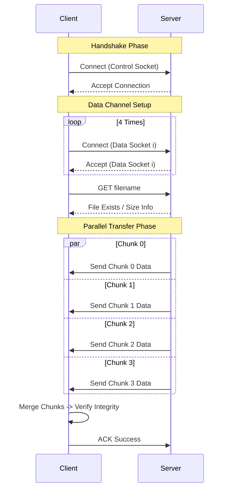

# ⚡ Socket Project - File Transfer System

<div align="center">


A robust, multi-threaded file transfer application built with raw Python sockets. Designed to demonstrate high-performance parallel data transmission using custom chunking protocols over both TCP and UDP.

[Report Bug](https://github.com/Startdust404/SocketProject/issues) · [Request Feature](https://github.com/Startdust404/SocketProject/issues)

</div>

---

## 📖 Introduction

This project implements a sophisticated file transfer system that goes beyond simple socket communication. Unlike standard sequential transfers, this application utilizes a **parallel socket architecture** to maximize bandwidth usage and improve transfer speeds.

Whether you're transferring small text files or large binaries, the system automatically handles:
- **Parallel Chunking**: Splitting files into 4 independent parts transferred simultaneously.
- **Protocol Flexibility**: seamless switching between TCP (reliability focus) and UDP (speed focus).
- **Integrity Verification**: Automatic checksum validation to ensure data correctness.
- **User-Friendly Interface**: Includes both a full-featured GUI and a powerful CLI.

## ✨ Key Features

- **🚀 Multi-Socket Architecture**: unique 1+4 connection model (1 Control + 4 Data channels) for parallel throughput.
- **🛡️ Dual Protocol Support**:
    - **TCP Mode**: Guaranteed delivery with ordered, reliable streams.
    - **UDP Mode**: High-speed datagram transmission with custom reliability layers.
- **📊 Real-time Monitoring**: Visual progress tracking for individual file chunks.
- **🖥️ Cross-Platform GUI**: Built-in graphical interface for easy server management and client downloads.
- **🔧 Highly Configurable**: Adjustable buffer sizes, timeouts, and chunk counts via `constants.py`.

## 🏗️ Architecture

The system employs a **Manager-Worker** pattern. A control connection establishes the session, while dedicated worker threads handle data chunks in parallel.

### Connection Flow (TCP Example)



## 🚀 Installation

1.  **Clone the repository**
    ```bash
    git clone https://github.com/yourusername/socket-project.git
    cd socket-project/Source
    ```

2.  **Verify Prerequisites**
    - Python 3.7 or higher is required.
    - No external `pip` dependencies needed (uses standard library).

## 🎮 Running the Project

### Option A: GUI Mode (Recommended)

The easiest way to use the application.

**1. Start the Server**
```bash
python gui_server.py
```
*Configure the port (default 5000/TCP) and select the folder you want to share.*

**2. Start the Client**
```bash
python gui_client.py
```
*Enter the server's IP, connect, select files from the browser list, and click Download.*

---

### Option B: Command Line Interface (CLI)

For automation or headless environments.

#### TCP Mode

**Server**
```bash
# Default (Host: 127.0.0.1, Port: 5000)
python run_tcp.py server --folder ./shared_folder

# Custom Host/Port
python run_tcp.py server --host 0.0.0.0 --port 8080 --folder ./my_files
```

**Client**
```bash
# Download files listed in input.txt
python run_tcp.py client --folder ./downloads --input ./input.txt
```

#### UDP Mode

**Server**
```bash
# Default (Host: 127.0.0.1, Port: 6000)
python run_udp.py server --folder ./shared_folder
```

**Client**
```bash
python run_udp.py client --folder ./downloads --input ./input.txt
```

#### Input File Format (`input.txt`)
The client reads a simple text file to know which files to request:
```text
image.png
report.pdf
data.csv
```

## ⚙️ Configuration

You can fine-tune performance in `core/constants.py`:

| Constant | Default | Description |
|:---|:---|:---|
| `NUM_SOCKET` | `5` | Total sockets per client (1 Control + 4 Data) |
| `NUM_CHUNK` | `4` | Number of chunks to split files into |
| `BUFFER_SIZE` | `10KB` | TCP receive buffer size |
| `PACKET_SIZE` | `8KB` | UDP packet size |
| `TIMEOUT` | `0.2s` | UDP socket timeout |

## 📂 Folder Structure

```
Source/
├── client/              # Client-side logic
│   ├── tcp_client.py
│   └── udp_client.py
├── server/              # Server-side logic
│   ├── tcp_server.py
│   └── udp_server.py
├── core/                # Shared core modules
│   ├── file_handler.py  # Chunk management & merging
│   └── constants.py     # System configuration
├── gui_server.py        # Server GUI Entry Point
├── gui_client.py        # Client GUI Entry Point
├── run_tcp.py           # CLI Entry Point (TCP)
└── run_udp.py           # CLI Entry Point (UDP)
```

## 🤝 Contribution

Contributions are welcome! Please follow these steps:

1. Fork the project.
2. Create your feature branch (`git checkout -b feature/AmazingFeature`).
3. Commit your changes (`git commit -m 'Add some AmazingFeature'`).
4. Push to the branch (`git push origin feature/AmazingFeature`).
5. Open a Pull Request.

## 📄 License

Distributed under the **MIT License**. See `LICENSE` for more information.

## 🗺️ Roadmap

- [ ] Add encryption (SSL/TLS) for secure transfer.
- [ ] Implement file compression before transfer.
- [ ] Add support for resuming interrupted transfers.
- [ ] Dynamic adjustment of chunk size based on network conditions.

---

<div align="center">
  <p>Star ⭐ this repository if you find it helpful!</p>
</div>
